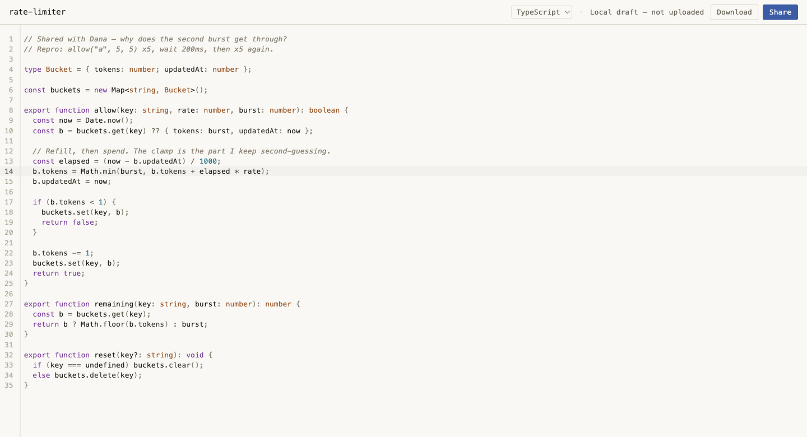
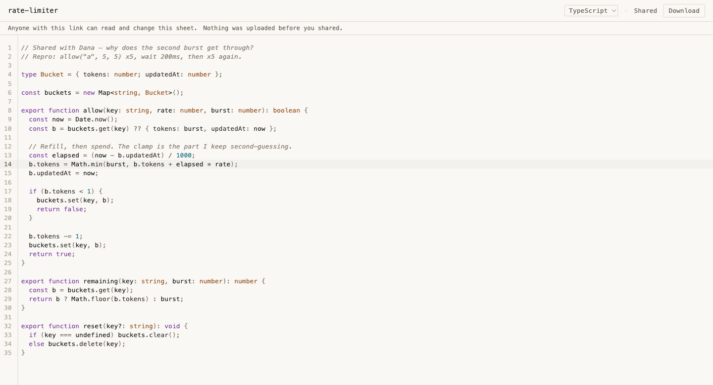

# Galley

**Real-time collaborative code sharing.** Open a local code draft, press **Share**,
and it becomes an authoritative server-backed *sheet* with a link you can send to
a collaborator — who opens the same URL and edits the same document. The
reconstruction is building a focused shared coding surface (closer to a
collaborative code sheet than a full IDE), with version history planned as a
quiet recovery surface rather than the centrepiece.

> The repository slug is `echo-rewind`, the name of the retired timeline-first
> product this branch reconstructs away from. It is kept for history — the
> product is **Galley**, and `docs/PRODUCT_BRIEF.md` governs.



*A local draft. The screenshot shows the local, not-uploaded UI state; that no
sheet, fetch, or WebSocket exists before Share is verified by the implementation
and by `e2e/draft.spec.ts`'s "opens no collaboration/application WebSocket while
editing (no upload before Share)" test, not by the image itself.*



*The same document one **Share** click later: same text, same cursor, title and
language now authoritative and read-only, and the sheet server-backed at
`/{sheetId}` with its link on the clipboard. The editor is not remounted across
that handoff — undo history included; that part is proved by the test suite, not
by the picture. Both frames are current-HEAD captures; see
[`docs/screenshots/current/`](docs/screenshots/current/).*

> **Status: in-progress reconstruction.** The **shared-draft adoption milestone**
> (Share handoff) completed at commit `3214cef` on `reconstruction/collab-first`.
> Work since then is **M4.5 — consolidation, de-risking, and Download**: dead-code
> removal, live-defect fixes, Download/export, a committed inbound-path benchmark
> baseline, and a deployment-architecture gate. It is a closeout milestone, not new
> architecture.
>
> Live presence/cursors, durable "saved" state, and Recent versions are **planned,
> not yet built** — see "Not yet built" below. There is no public hosting: nothing
> is running at a public URL.
> `docs/PRODUCT_BRIEF.md` is the canonical product definition;
> `docs/RECONSTRUCTION_STATUS.md` records what the M4 milestone actually shipped.

## What it can do today

- **Local draft at `/`** — a syntax-aware CodeMirror 6 editor with a document
  title and language selector, real Yjs undo/redo, and Find/search. Nothing is
  uploaded and no socket is opened while editing.
- **Share → adopt** — one gesture creates the sheet on the server (durable **as
  created**; see "Not yet built"), copies the edit link, and swaps the URL to
  `/{sheetId}` **without remounting the editor**, so the exact same document,
  selection, and undo history carry over. Pre-Share edits remain undoable after
  Share.
- **Authoritative metadata** — after adoption the title and language are reconciled
  from the server's bootstrap response and shown read-only; transient local values
  never flash as if they were authoritative.
- **Direct-load / join** — opening `/{sheetId}` in another browser bootstraps the
  sheet's metadata, joins the shared session over WebSocket, and converges both
  peers. A refresh rejoins the same live room for as long as the server process
  still holds it in memory. What survives a server restart is the sheet **as it
  was created**, not the edits made after Share — see "Not yet built" below.
- **Download / export** — one click yields a file whose name derives from the
  sheet title and whose extension derives from its language, containing exactly the
  current live text. Available on the local draft and on a joined shared sheet.
  Pure client: no upload, no server round-trip.
- **Bounded lifecycle and connection states** — the UI distinguishes *Local draft
  — not uploaded*, *Sharing…*, *Shared*, *Connecting…*, *Connection stopped.*, and
  a *couldn't share* fallback that keeps the draft safe. A clipboard failure still
  surfaces a selectable URL with a manual **Copy link** control. These are
  lifecycle and transport states only: nothing in the UI says *Saving* or *Saved*,
  because the mechanism that would make such a claim true is M5.

## What's technically interesting

- **No-remount Share handoff** — the local draft's `Y.Doc`, `Awareness`, and
  `Y.UndoManager` are handed to the collaboration provider intact, so sharing never
  tears down the editor and never loses in-flight edits or undo history.
- **Generation-safe session lifecycle** — the shared-sheet page tags each async
  open with a generation id and abort controller, so StrictMode double-invocation,
  route changes, and stale terminal callbacks can never publish into a newer
  session or double-dispose a controller.
- **Idempotent durable create** — creation is keyed by a per-draft token so a lost
  response is recoverable without minting a second sheet. The server validates and
  canonicalizes the submitted Yjs update itself, then writes the sheet in one
  `BEGIN IMMEDIATE` SQLite transaction (WAL, `synchronous = FULL`, both verified
  at open). A per-sheet serialized write queue is built and tested alongside it as
  the ordering seam M5's live persistence will need — **no live path enqueues to
  it yet**.
- **Deterministic end-to-end tests** — a test-only, generation-scoped create
  *barrier* lets Playwright prove "an edit made while Share is in flight survives"
  without sleeps, and reset/shutdown settle any barrier-held create before clearing or
  closing storage.

## Tech stack

Vite · React 19 · TypeScript · CodeMirror 6 · Yjs · y-websocket ·
y-codemirror.next · y-protocols · `ws` · `node:sqlite` · Tailwind v4 · Vitest ·
Playwright. Requires Node `>=22.22.2 <23` (see `.nvmrc`).

## Running locally

```bash
npm ci
```

Then two commands, in **two separate terminals** — both must be running for Share
and join to work:

```bash
npm run server
```

```bash
npm run dev
```

`npm run server` is the collaboration server (HTTP API + WebSocket) on
`http://127.0.0.1:1234`. `npm run dev` is the Vite client on
`http://127.0.0.1:5173`, which proxies `/api` and `/ws` through to it, so the
browser only ever talks to one origin.

Open `http://127.0.0.1:5173/`, type in the draft, then press **Share**. The URL
becomes `/{sheetId}`; open that URL in a second browser to join. See the demo
walkthrough (§5) in `docs/RECONSTRUCTION_STATUS.md` for the full flow.

## Testing

```bash
npm run test              # client unit tests — Vitest / jsdom (325)
npm run test:integration  # server + client-lifecycle tests — Vitest / node (403)
npx tsc --noEmit          # TypeScript type check
npm run build             # production build (tsc -b && vite build)
npm run test:e2e          # Playwright end-to-end (25)
npm run bench             # inbound-path preflight benchmark → docs/BENCHMARK.md
```

At the M4.5 closeout checkpoint this README describes: **753 automated tests**
(325 unit + 403 integration + 25 Chromium e2e), type check clean, production build
clean. That number is a snapshot of a branch still under development — CI
(`.github/workflows/ci.yml`), which runs unit tests, integration tests, the
TypeScript type check, the production build, Playwright end-to-end (Chromium),
and a whitespace check on every push and pull request, is the live figure. The
integration suite uses a separate config (`vitest.integration.config.ts`) and is
**not** part of `npm run test`.

`npm run bench` is a separate, independently run architecture/performance gate —
it is **not** part of the CI workflow above. Its recorded pre-M5 result lives in
`docs/BENCHMARK.md`.

## Current status

- **Branch:** `reconstruction/collab-first` (active reconstruction).
- **Last milestone commit:** `3214cef` — completed the shared-draft adoption
  milestone (Share handoff). M4.5 closeout work sits on top of it.
- **Packaging:** a **draft** pull request into `main` tracks this branch; it is
  work-in-progress packaging, not the final reconstruction release.
- **Deployment:** the repository carries the deployment topology — a production
  `Dockerfile`, a single-writer Compose stack behind a TLS proxy with a persistent
  volume, and a reference Fly.io config (`deploy/`, `docs/DEPLOYMENT.md`) — and it
  was exercised locally end to end. What is absent is **public hosting**: nothing
  is running at a public URL and nothing has been deployed to a platform. That is
  M12.
- **Stable checkpoints (never moved):** `week1-demo` (`ca8bb48`) and `prototype-v1`
  (`4147372`) preserve the earlier timeline-first prototype.

## Not yet built (roadmap)

Live presence, remote cursors/selections, and jump-to-collaborator (the awareness
relay itself works, so y-codemirror.next paints its **unstyled anonymous default**
caret and selection for a remote peer — visible in
[`03-joined-sheet.png`](docs/screenshots/current/03-joined-sheet.png), and it is
the library's default rendering, not a Galley design; per-collaborator identity,
colour, a presence surface, and Back-to-your-place are the unbuilt parts) ·
durable `Shared · saved` state (content + metadata coverage) · title/language
conflict handling · Recent versions and local read-only preview · retention/expiry ·
public hosting. These are sequenced in `docs/IMPLEMENTATION_PLAN.md`; the next
milestone is **M5 — durable live persistence and truthful state**.

Note the shape of what exists today: a shared sheet is **durable at creation, not
continuously persisted**. Live edits after Share are relayed between clients and
held in the server's in-memory `Y.Doc`, so they do not survive a server restart —
a restarted room rehydrates from the creation-time canonical state. Writing those
edits back on an interval, and the Saving/Saved state that must accompany it, is
M5.

## Intentionally out of scope

Authentication and accounts · multiple files or a file tree · code execution,
terminal, or output panes · chat and comments · AI or autocomplete · linting or
automatic formatting · a permanent timeline · restore from version ·
branching/forking. The product is deliberately a single shared code sheet, not an
IDE.

## Documentation

- `docs/PRODUCT_BRIEF.md` — canonical product definition.
- `docs/RECONSTRUCTION_STATUS.md` — **as-built** status, architecture, demo, and QA
  for the current milestone (`3214cef`).
- `docs/RECONSTRUCTION_ARCHITECTURE.md` — the reconstruction architecture (design
  contract this milestone implements a slice of).
- `docs/IMPLEMENTATION_PLAN.md` — milestone plan (M0–M12).
- `docs/DECISIONS.md` — decision log (prototype + reconstruction).
- `docs/BENCHMARK.md` — committed inbound-path benchmark baseline and verdict.
- `docs/DEPLOYMENT.md` — deployment-architecture gate: topology, volume, and the
  single-writer evidence.
- `docs/screenshots/current/` — current-HEAD screenshots and what each proves.
- `docs/screenshots/` — the dated M4 milestone set, preserved as captured.
- `docs/ARCHITECTURE.md` and `docs/archive/prototype-v1/` — historical
  (`prototype-v1`); preserved, not active direction.
